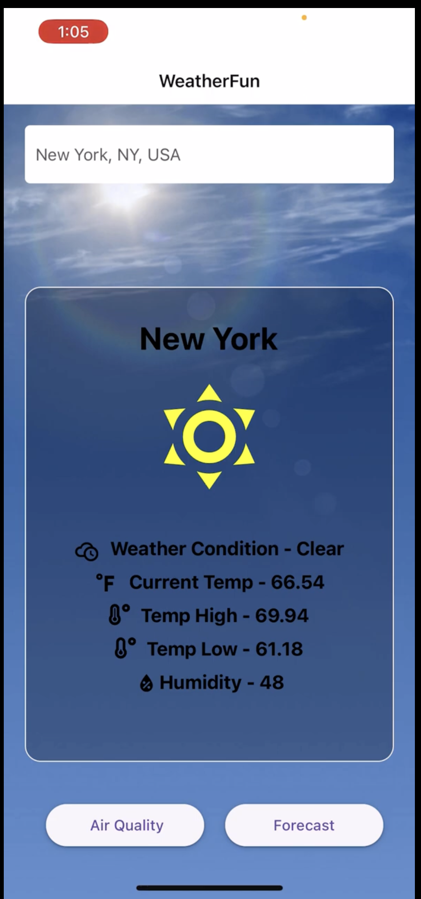
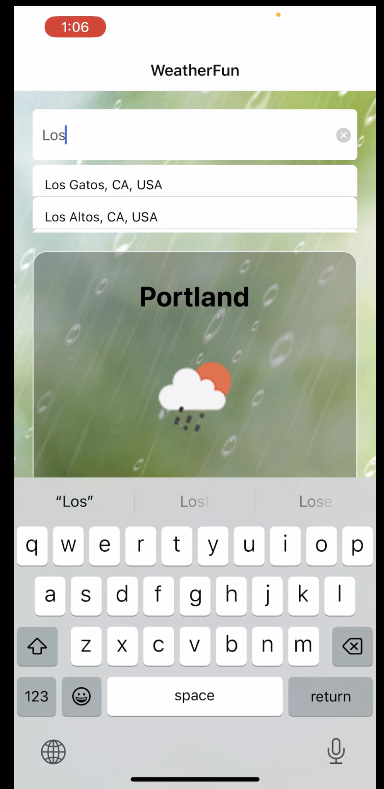
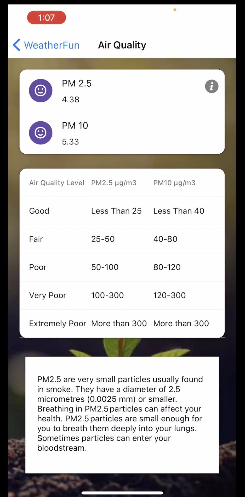
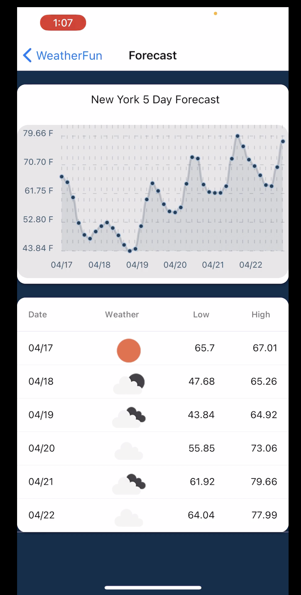

Title - Climate Check

1. Climate-Check is a React Native mobile app powered by OpenWeather API. 
2. Users can check the current weather condition, air pollution level, and 5 day forecast for a    particular place. 
3. Search bar powered by Google Places API to help users search cities around the world. 
4. UI Styled with CSS & React Native paper library. 
5. Utilized React Native chart library to display a graphical representation of 5 day forecasted temperature data.
   

<video src='https://www.youtube.com/watch?v=4uBtcztp_nk' width=180></video>
To run this App-
1. You can clone this repo. 
2. You need Google places API key and OpenWeather API key. Add the keys to your .env file
3. Once, the project is setup, run :- npm start

# Sample Snack app

Open the `App.js` file to start writing some code. You can preview the changes directly on your phone or tablet by scanning the **QR code** or use the iOS or Android emulators. When you're done, click **Save** and share the link!

When you're ready to see everything that Expo provides (or if you want to use your own editor) you can **Download** your project and use it with [expo-cli](https://docs.expo.io/get-started/installation).

All projects created in Snack are publicly available, so you can easily share the link to this project via link, or embed it on a web page with the `<>` button.

If you're having problems, you can tweet to us [@expo](https://twitter.com/expo) or ask in our [forums](https://forums.expo.io/c/snack).

Snack is Open Source. You can find the code on the [GitHub repo](https://github.com/expo/snack).
